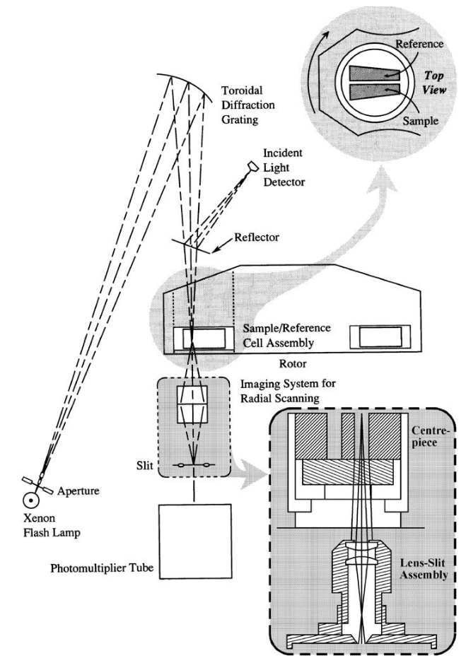

 
MS: &#x2717;
 
BS: &#x2717;

# Absorbance 
The basic principle of absorption optics is described by the Beer-Lambert Law:

$$
A = \log{\frac{I_{0}}{I}} = \epsilon c a,
$$

where $A$ is the absorption, $I$ is the intensity of light, $\epsilon$ is the specific decadic absorption coefficient, $c$ is the concentration of the sample, and $a$ is the optical path length.

!!! danger ""

    {width="800"align=center}
    
    Ralston G (1993) Introduction to analytical ultracentrifugation. Beckman Instruments, Fullerton, C

The absorbance optics in the Beckman Coulter AUCs use high-intensity xenon flash lamps that allow for the use of wavelengths ranging from 190 nm to 800 nm. The lamp is fired briefly as the sector passes the detector. A slit below the sample allows for sampling of different radial positions. Multiple readings at the same position can be collected and averaged, minimizing noise.
The triggering of the lamp is based on the exact measurement of the actual rotor speed, which is realized by a Hall-effect sensing devices based on the over-speed disk on the bottom of the rotor. As the over-speed disk passes a sensing device, an electrical signal is induced. The position of the cell, and that of the cell sector, can then be determined. The duration of a single flash is about 2 -3 $\mu$s, and with a maximum shot frequency of 100 Hz, the flash lamp can flash every ten revolutions at the maximum speed of 60,000 rpm.

The aperture of the lens-slit assembly determines radial resolution. It moves using a step-motor (XLA) driven by a motor. The step width, $\Delta$r can be adjusted is necessary. The lens focuses the light on the photo-multiplier tube, which measures the intensity of light passing through the measuring cell. 

The camera lens of the lens-slit assembly creates an image of a slice of constant radius. Another aperture at the bottom of the lens-slit assembly reduces the stray light.

# When to Use

Samples can be examined in concentrations that are too dilute for systems such as Schlieren optics. This accessibility to lower concentrations means that one can now examine stronger interactions, $K > 10^{7}$ M$^{-1}$.

DRAWBACKS: duration of measurement; Wiener skewing

The optical absorbance system is the most widely used detector in the AUC. 

In the XL-I, the absorbance system requires a at least a minute in order to scan a single sample, and it has notoriously poor wavelength reproducability.[^Cölfen2010] Ideally, you want a continuous light source and software synchronization, simultaneous acquisition of data from samples, 100-fold better wavelength reproducibility, 10-fold higher sensivitivy and precision, and twice the radial resolution.[^Laue2006]

OPTICAL DENSITY: Boasts a lower limit of ~0.1 OD due to the low signal-to-noise ratio (optimal at 230 nm).

Generally should not be used for samples with an optical density above 1.0 OD. At that point, there may be non-linearity of the absorbance signal.

WAVELENGTHS:

Use lower wavelengths for small protein concentrations.

Protein extinction is usually 3-10 fold better when using 230 nm over 280 nm. Do not measure at concentrations above 0.9-1.0 O.D. Check extinction profiles of your sample.

In SV-AUC, do not change the wavelength mid-run. When measuring multiple concentrations at different wavelengths, perform multiple runs.

For DNA and DNA-protein complexes: scanning at 260 nm enables much lower sample concentrations, due to the high extinction profiles of DNA.

BUFFERS: 

Buffers should not absord, or only a very little. This requirement can mean that you must exclud strong UV-absorbing species such as DTT.

Always check aborbance again a water blank to confirm the level of baseline absorbance. Most of the signal should come from the sample, not the buffer. All together, both analyte and bufffer should not exceed the dynamic range of the detector.

## Intensity vs. Absorbance 

Cn be used to measure samples in the reference channel as long as the total OD is less than 0.5 OD to avoid resetting of PMT setting.

In general, fill centerpiece as full as possible (~0.46 ml), but leave some room above the meniscus to provide an air region for intensity referencing.

Requires time/radially invariant noise removal by fitting with [2DSA](/2dsa.md).

Reduces stochastic noise by a factor of the square root of 2.

Provides absolute intensity data to check instrument performance.

 When designing AUC experiments for UV optics it is highly recommended to measure in intensity rather than absorbance mode. Unlike absorbance data, intensity data is not convoluted with the random noise acquired in a reference measurement, producing better fits with lower RMSD values. In the process of collecting absorbance data in the Beckman XL-A, the reference channel data is subtracted from the sample channel data, thereby convoluting the random noise from the reference channel with the random noise from the sample channel. Whenever two noisy vectors are added or subtracted from each other, the noise level increases by the square root of 2, or a factor of ~ 1.4. The UltraScan software used in our laboratory is perfectly capable of accurately calculating the baseline levels of any experimental dataset using established algorithms, so a reference subtraction as done in absorbance experiments is no longer needed.

There are other advantages: In intensity mode both channels are scanned into separate datasets, making it possible to double the capacity of the instrument by using both channels for samples. There is only one catch: The OD in the reference channel must be less than 0.5 OD (as detected in a 1.2 cm pathlength cell), regardless of wavelength, to prevent a resetting of the photomultiplier gain set. If the total OD (including baseline absorbance compared to ddH2O) is less than 0.5 OD, the gainsets will not be changed. A gainset adjustment in the XLA during the experiment has important consequences: The data will be rescaled at a different scale, the baselines will shift, and the entire experimental data can no longer be globally analyzed in a single fit. Each dataset acquired at a different gainset needs to be analyzed separately (although the individual datasets can still be combined to be analyzed in a global fit). But this is tedious and inconvenient.

This limitation actually works in our favor: For many proteins it is interesting to study the protein at different concentrations. If a protein is reversibly self-associating, measuring a 0.3 and a 0.9 OD concentration under the same conditions will reveal mass action effects and tell us if the protein is self-associating. Hence, it is advisable to always measure at least two concentrations of each sample (0.3 and 0.9 OD, as measured in a standard 1.0 cm pathlength cuvette), with the 0.3 OD sample placed into the reference channel, and the 0.9 OD sample into the sample channel. 

#  Pros and Cons

<u>Advantages</u>

Great for low concentrations of proteins or nucleic acids
Always good to measure at lower concentrations; molecules sediment and diffuse ideally, and you avoid concentration-dependent non-ideality.

Uses absorbance maximum.
Where do you get the most signal? Pick those wavelengths.

Flexible wavelength selection.

Second channel can be used another sample in intensity mode.

supports MWL-AUC on Optima.

<u>Disadvantages</u>

Slow scanning speed (worse on XL-A). slit assembly motor is much faster than servo-motor.

Monochromator does not reset properly, so you can only use one wavelength (XL-A only)

Intensity variation as a function of wavelength (see [Xenon Lamp Maintenance](/maint.md)).

Sensitive to refractive artifacts causing distortions in radial position. Worse for higher refractive solutions.

Buffers should be non-absorbing

[^Cölfen2010]: Cölfen H, Laue TM, Wohlleben W, Schilling K, Karabudak E, Langhorst BW, Brookes E, Dubbs B, Zollars D, Rocco M, Demeler B. The Open AUC Project. Eur Biophys J. 2010 Feb;39(3):347-59. doi: 10.1007/s00249-009-0438-9. Epub 2009 Mar 19. PMID: 19296095; PMCID: PMC2812709.

[^Laue2006]: Laue TM, Austin JB, Rau DA. A light intensity measurement system for the analytical ultracentrifuge. Prog Colloid Polym Sci. 2006;131:1–8. doi: 10.1007/2882_001.
