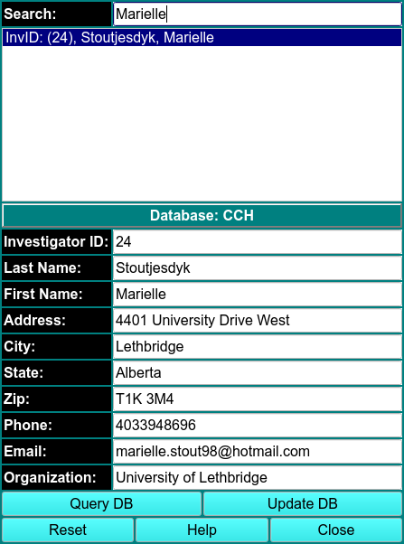

# Manage Investigator Data

Here you can update any personal information. Your database authorizations must allow for update privileges.

{width="300"align=right}

1. Use Query DB to get a list of persons that are in the current database.

2. Entering text in the Search window narrows the number of entries visible.

3. Double-click on the name of the investigator to populate the line edit windows to allow for viewing and for changing of personal data.

4. Change any data desired.

5. Use Update DB to commit the changes to the database.

6. Use Accept to pass the information back to the calling program and close this dialog or Cancel to simply close without changing the investigator data.