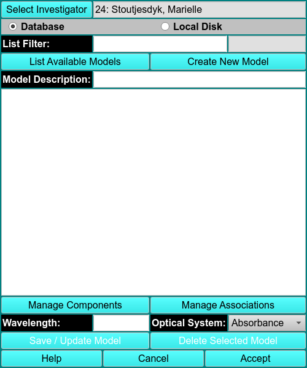
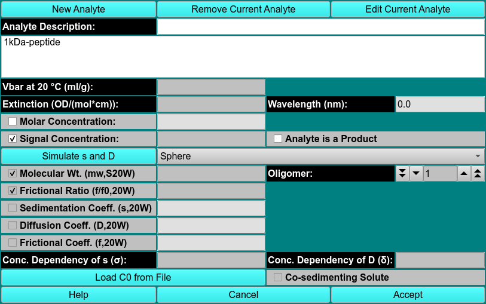
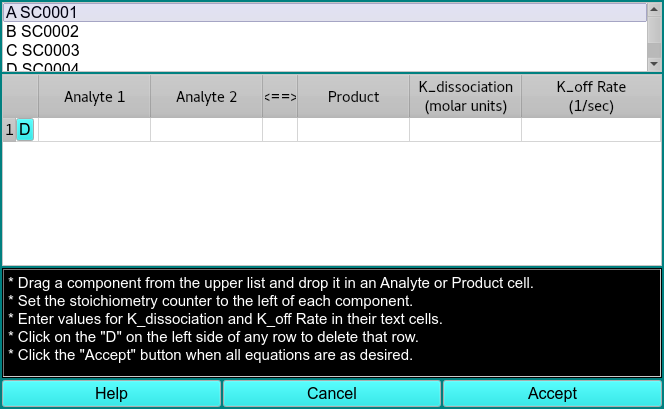

# Manage Models

!!! warning ""

    
    
List Avaliable Models This button initiates population of the list of models from the designated source.

Create New Model This button designates that the model to be specified and used by the caller in new. 

Manage Components This button brings up a Model Components Dialog in which the model components and their properties can be specified.

!!! warning "Model Components"

    {width="textwidth"}
    
    Analyte Description Enter in the text box the name to be given to the newly created analyte or the new name to be given to a currently selected analyte.
    
    Vbar at 20 C (ml/g) Enter the vbar value at 20 degrees Centigrade.
    
    Extinction/Wavelength Enter the extinction value for the read-only-displayed wavelength.

    Molar Concentration Read-only molar concentration calculated from Extinction and Signal Concentration.
    
    Signal Concentration Enter the analyte's signal concentration value.
    
    Exactly 2 of the 5 component parameters (molecular weight/oligomer, frictional ratio, sedimentation coefficient, diffusion coefficient, and frictional coefficient) should be checked and their values possibly modified. Values of the unchecked parameters are calculated from the two selected.
    
    Simulate s and D This will bring up a shape dialog that uses axial ratios to [model s, D, and f, from MW for 4 basic shapes](/probable-eureka/sim-modelsdf).
    
    Shape Select from the drop-down menu the shape of your solute: sphere, prolate ellipsoid, oblate ellipsoid, or rod. 
    
    Conc. Dependency of s ($\sigma$)
    
    Conc. Dependency of D ($\sigma$)
    
    Load C0 from File Click this button to begin an input file dialog in which you can specify a file with first-scan concentration values.
    
    Co-Sedimenting Solute Check this box to specify that the current component is a co-sedimenting solute.
   
    

Manage Associations This button brings up a Model Associations Dialog in which the model associations and their properties can be specified.

!!! warning "Model Associations"

    In this dialog, you can define reversible associations of model components. Associations are constructed in terms of chemical equations with one or two analytes on one side and a product on the other.
    
    Each association row is built by dragging a model component in the upper list to an Analyte or Product cell.As each analyte is dropped, its code letter (A, B, C, ...) appears in the cell with a subscript that represents the oligomer number of the molecule. At least one Analyte and one Product cell must be thus populated. The implied chemical equation must be balanced by setting the stoichiometry counter in each cell such that stoichiometry times oligomer value(s) on the left equals the product of stoichiometry and oligomer on the right. K_association and K_off Rate values should be entered for each row.
    
    Once all association rows have been validly built, click the Accept button to set the reversible association parameters for the model. If a row is wrong and cannot be easily corrected, click the "D" button on the left side of the row to delete that row so that it can be rebuilt.
            
    {width="800"}
      
    
    Analyte List The upper list of model components is populated from the model passed by the calling object. Members of this list can be dragged to the table below to construct association equations.
    
    Chemical Equation Associations Table A table with one or more rows is constructed to represent the reversible associations present in the model.
    
    Analyte 1 Each row for an association must have this column populated by dragging and dropping a list component. Analyte 2 is optional.
    
    Product Each row for an association must have this column populated by dragging and dropping a list component. Like the Analyte cell(s), a component will be represented by its code letter and a subscript showing its oligomer number. The stoichiometry counter should be set so stoichiometry-time-oligomer balances on the sides of the equation.
    
    K_association Enter the K_association in molar units for each association row.
    
    K_off Rate Enter the K_off Rate value in reciprocal seconds for each association row.
    
    If you click the Accept button and the equation does not balance, a dialog informing you of this imbalance will appear. Correct the equation and try again.

Wavelength Specify the model wavelength value here.

Optical System Select the model optical system: absorbance, interference, or fluorescence.