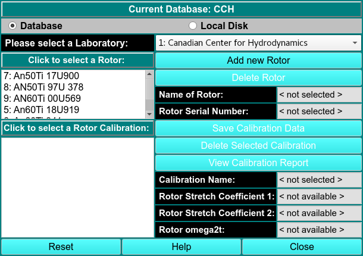
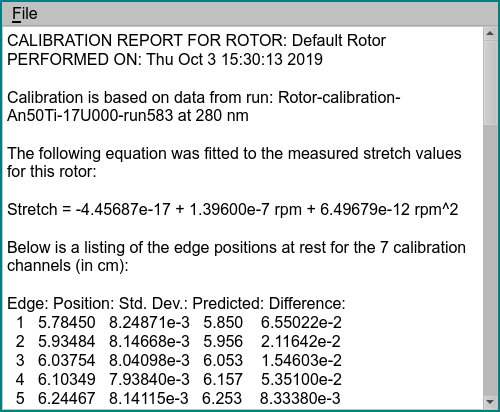
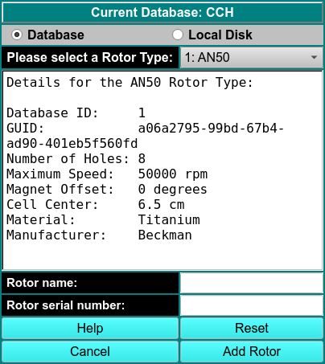

# Manage Rotors

!!! warning ""

    {width="800"}
    
{width="300"align=right}

Using this window, you can manage rotor information. Make sure that you are in the correct database. 
   
Select a Laboratory Select the appropriate lab in the drop-down box. 

Click to Select a Rotor Select the rotor that is being used.

Select Rotor Calibration Select the correct rotor calibration profile. Rotor calibrations are sorted in reverse order by data. The most recent and best choice is at the top.

View Calibration Report Click here to view the calibration report associated with the selected rotor.

{width="300"align=right}

You can come to this window from [<u>Utilites:Rotor Calibration</u>](/probable-eureka/utilities-rotor), allowing you to associate the calibration you collected with an rotor. Click on the rotor you would like to associate, and click on Save Calibration Data. This action is only possible for administrators.

If you are an administrator and would like to add a new rotor, click on Add New Rotor. In the dialog, select the rotor type (AN60, AN50, or Simulation) and add the appropriate details into Rotor Name and Rotor Serial Number. All other details are generated automatically.

