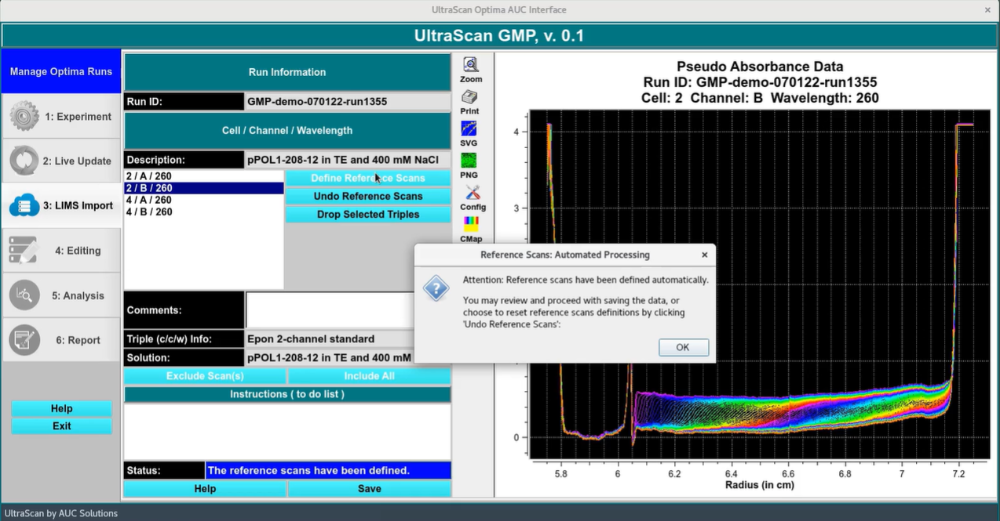

# GMP LIMS Import

!!! danger ""

    

Here, the experimentatal data is imported into the LIMS database from the PostgreSQL database on the Optima. The data will be converted from its intensity form to a pseudo-absorbance form by applying a reference correction.

Review each triple and delete any triples if necessary (leaked cells, etc.).