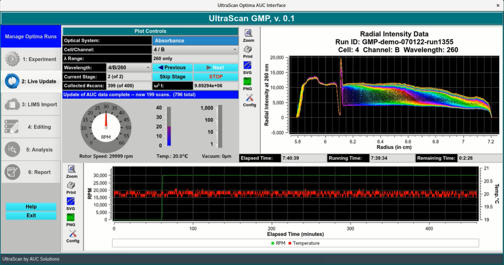

# GMP Live Update

!!! danger ""

    

<u>A video on the Live Update stage is avaliable [here](https://www.cch.uleth.ca/media/gmp-part2B.mp4).</u>

When we submit the protoccol, the Optima AUC will recieve all the information it needs through the network. It wil also be stored in the LIMS database so it can be used in the future. A dialog will appear to instruct you to go to the instrument and start the run manually. This dialog will disappear when the Optima is started.

 Stage 1: Temperature Equilibration

The program will start recording the temperature and rotor speed trace, as well as the state of the vacuum. 

Stage Two: Rotor Acceleration
The rotor will accelerate to the set speed. The $\omega^{2}t$ dialog will update 
accordingly.
The science modules will now be calibrated. Once this is finished, the first scans will start to appear

 Stage Two: Data Collection

At this point, we can confirm that the cells are not leaking by going through each cell and channel and observing the postion of the mensicus. They should overlay and be at the same position.

At the end, the rotor will decelerate and the program will automatically move onto the [next module](/gmp-limsimport).