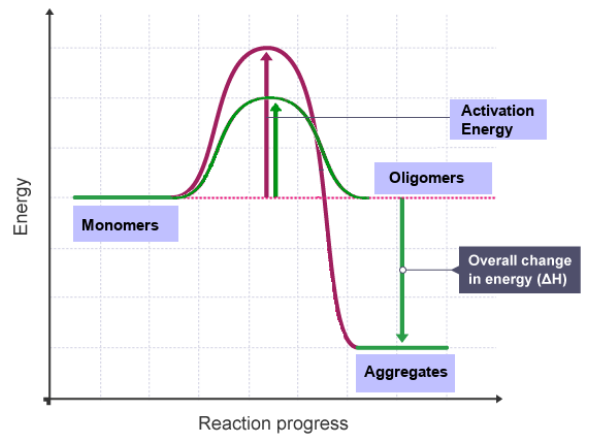

# Macromolecular Interactions

On this page, we will study molecular interactions that occur in cellular systems, and how they can be studied by absorbing their transport. Specifically, we will cover irreversible interactions that can lead to aggregation, and reversible interactions that are driven by mass action.

!!! note "TL;DR"
    
    Irreversible interactions lead to aggregation which is typically pathologic or unphysiological.

    Reversible interactions are cause by weak interactions (electrostatic, hydrophobic) and lead to **oligomerization**.

Molecules in solution can display dynamic behaviour in response to external perturbations and changes in their own concentration or environments.

In particular, interactions between molecules can lead to **covalent bond formation** or **non-covalent bond formation**.

**Assemblies** are formed when molecules interact with other molecules to form higher-order structures. When this interaction is between similiar molecules, it is refered to as **self-association**. When it is between molecules of different species, it is refered to as **hetero-association**.

Self-Association: 

$A + A \rightarrow A_{2}$. 

Eg., protein-protien, RNA-RNA, DNA-DNA.

Hetero-Association: 

$A + B \rightarrow AB$.

Eg., protein-DNA, protein-RNA, DNA-RNA, protein-lipid, protein-carbohydrates, protein-small molecules/drugs/nanoparticles.

Which interaction occures depends on the activation energy that needs to be overcome to interconvert between the forward and backward reaction.
When the energy barrier becomes too high to go backwards, an interaction reaction is considered to be irreversible.

{ align=right }

## Irreversible Interactions

Examples of events that can cause irreversible solution interactions:

1. Oxidation

2. Covalent Cross-Lining (chemically or photo-activated)

3. Hydrophobic, van der Waals interactions, coupled with entropic effects

4. Strucutral changes in the molecules (amyloid beta - beta sheet, insulin fibrils)

 
??? danger "EXAMPLE"
    
    !!! danger "Amyloid Beta Aggregation "

        Speransky, V. et al. 2001 J. Cell Biol., 153, 1327 - 1335
 

## Reversible Interactions

Reversible interactions typically require structural complementarity and are cause by weak forves and molecular attractions (electrostatic, hydrophobic, salt bridgess, van der Waals forces, and hydrogen bonds).

**Electrostatic interactions** are very important for nucleic acid binding. Dna has a strongly negatively charged backbone (PO_4^-), which can form salt bridges with positively charged amines from lysine sidechains, allowing the stiff, double-stranded DNA to curl around the nucleosome and become flexible.

There can be multiple types of reversible reactions that are either self-associations or hetero-associations. 

The concentration in one component will affect the concentration of the other. Reactions can be fast (diffusion controlled) or slow (kinetically limited), and they observe mass action laws.

 
??? danger "EXAMPLE"
    
    !!! danger "Human "
    
        A. Schiefner et al., Biochem. J. 2015, 466(1) 95-104
 

There can be multiple reactions:  
$A + A \leftrightarrow A_{2}$  ;

$A_{2} + B \leftrightarrow A_{2}B$  ;

which can be fast (diffusion controlled) or slow (kinetically limited), and they observe mass action laws.

### Oligomerization

Reversible reaction (Le Chatelier's Principle):

$$
\sum_{i=1}^{n}M \leftrightarrow M_{n}
$$

Equilibirum Constant

$$
K_a = \frac{\[M_{n}\]}{\[M\]^{n}}
$$

Kinetics
$$
K_{a} = \frac{k_{on}}{k_{off}}
$$

Solve Polynomial

$$
\[M\] + \[M_{n}\] = C_{total}
$$

$$
\[M\] + K_{A}\[M\]^{n} - C_{total} = 0
$$

 
??? danger "EXAMPLE: Effect of Salt on Oligerimzation"

    !!! danger "A researcher studies a 50 kDa protein by sedimentation velocity. At high salt, Genetic algorithm Monte Carlo analysis shows a single species with a mean s-value of 3.5 Svedberg and a frictional ratio of about 1.45. As the salt concentration is decreased, a second species appears with an s-value of about 6.6 S and a frictional ratio of about 1.23. Assume the partial specific volume is constant at all salt concentrations at 0.72 ml/g. Explain a possible modelfor this observation. What can you conclude about the function of salt with respect to any oligomerization? What can you conclude about the oligomerization state? Draw a model of a molecule that would match these observations (Hint: keep in mind the frictional ratios!)"
    
        Lorem ipsum dolor sit amet, consectetur adipiscing elit. Morbi sit amet ultricies justo, sed maximus metus. Aliquam ac nisl elementum, commodo arcu eleifend, dapibus turpis. Mauris euismod semper rhoncus. Sed dignissim, mauris quis tempus molestie, quam felis consequat metus, sit amet elementum ex sapien in quam. Praesent non enim eleifend, aliquet justo sit amet, sollicitudin diam. Nunc auctor nunc sollicitudin nisi aliquet, ac sollicitudin libero venenatis. Aliquam ornare rutrum quam, eget finibus turpis vulputate sit amet. Pellentesque feugiat felis et sodales dignissim. Duis in elit nunc. Etiam ullamcorper neque a mi consequat, non sollicitudin est ultrices. Mauris sed turpis metus. Aenean dictum sem nec augue ullamcorper egestas

 
??? danger "EXAMPLE: Monomer-Dimer Equilibrium"

    !!! danger "Monomer-Dimer Equilibirum"

        Monomer-Dimer:
    
        $ A + A \leftrightarrow A_{2}$
        $ \[A\] + K_{a}\[A\]^{2} - C_{total} = 0
    
        Insert video of the self-association isotherms. Page 13 on Lecture 2. biophysics.uleth.ca
 

## Role of Solvent 

Interactions between molecules depend on the surface properties of the regions of the molecule that are interaction, and different solvents can amplify or eliminate these interaction effects, and change the Ka of interaction dramatically.

* Charge-charge interactions can be disrupted by increaseing ionic strenth

* pH changes may modify the charge on surface groups and alter electrostatic interactions

* Hydrophobic interactions can be disrupted by amphilillic detergents

* Steric hinderence can prevent proximity of interacting surfaces - domain may change shape upon binding of small molecules

