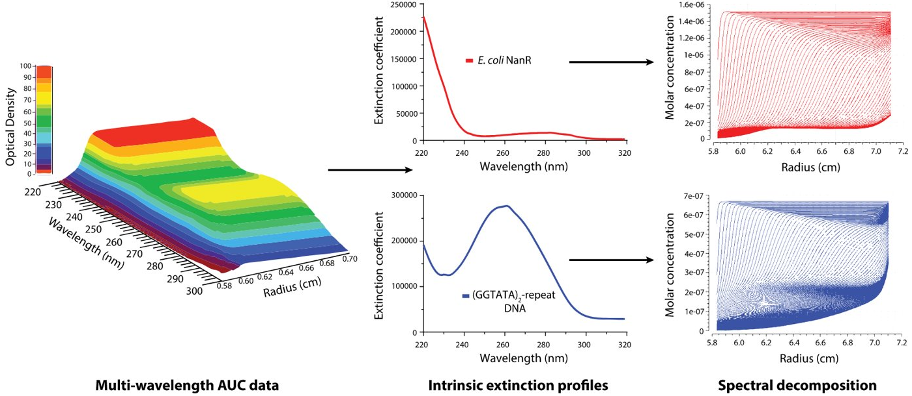

Multiwavelength Analysis Flowchart

!!! danger ""

    For an example of MWL analysis, see: 
    
    Horne, Christopher R., et al. “Multi-Wavelength Analytical Ultracentrifugation as a Tool to Characterise Protein-DNA Interactions in Solution.” European Biophysics Journal: EBJ, vol. 49, no. 8, 2020, pp. 819–827
    
    
    
Import and Editing $\rightarrow$ 2DSA Fits $\rightarrow$ Time-Synchronized Simulations $\rightarrow$ Spectral Deconvolution $\rightarrow$ 2DSA Fit
    
Initial 2DSA fits: mwl-sv datasets for each wavelength are analyzed to remove systematic noise and to determine boundary conditions.

Simulation of Models: sedimentation profile is generated by iteratively refining the 2DSA models for each components

Time Synchronization: 2dSA models are simulated to generate time-synchronized wavelength datasets

Spectral Deconvolution: mwl data is spectraly deconvoluted using molar extinction coefficents generatting spectrally seperated hydrodynamic results for each contributing component.

NNLS: Profiles are used to deconvulute multi-wavlength data in seperate datasets using an NNLS alogorithm

Individual 2DSA fits: each dataset is individually analyzed using the iterative 2dSA model.

<u>UltraScan Module</u> 

<u>US3 LIMS</u>

US Module Controls

US3 LIMS Controls

Before beginning the analysis flowchart, define the following solutions in [<u>Database: Manage Solutions</u>](/probable-eureka/database-solutions).

- all components in buffer

- all components in water buffer

- each individual component in water buffer

## 1. Export Data

## 2. Import Experimental Data

## 3. Edit Data

## 4. 2DSA: Fit Time-Invariant Noise

1. Log into the [<u>US3 LIMS portal</u>](https://uslims.uleth.ca) and navigate to Analysis: Queue Setup. 

2. Load the Dataset.

3. Setup 2DSA Control.

    a. Set the $s$-value Limits.

    b. Set $f/f_{0}$ Limits.

    c. Set the Resolution.

    d. Set the Grid Resolution.

    e. Select Fit Time Invariant Noise.
    
    f. Leave all other settings at default values.

4. Submit the Job to your desired cluster. Check Queue Viewer for job completion.
    
5. Review Model.

    a. Open [<u>Velocity: FE Model Viewer</u>](/probable-eureka/velocity-femodel) to confirm the results. 
    
    b. Load the Dataset. The file will be of the format "2DSA.run_name".
    
    c. Save Results.

## 5. 2DSA: Fit Meniscus, TR Noise, RI Noise

1. Log into the [<u>US3 LIMS portal</u>](https://uslims.uleth.ca) and navigate to Analysis: Queue Setup. 

2. Load the Dataset.

3. Setup 2DSA Control.

    a. Set the $s$-value Limits, Set $f/f_{0}$ Limits, Set the Resolution, and Set the Grid Resolution.

    b. Select Fit Time-Invariant Noise and Fit Radially-Invarient Noise.
    
    c. Select Fit Meniscus.s

4. Submit the Job to your desired cluster. Check Queue Viewer for job completion. This will take longer than the first 2DSA fit.

5. Review Model.

    a. Open [<u>Velocity: FE Model Viewer</u>](/probable-eureka/velocity-femodel) to confirm the results. 
    
    b. Load the Dataset. The file will be of the format "2DSA.FM.run_name".
    
    c. Save Results.

## 6. 2DSA: Iterative

1. Log into the [<u>US3 LIMS portal</u>](https://uslims.uleth.ca) and navigate to Analysis: Queue Setup. 

2. Load the Dataset.

3. Setup 2DSA Control.

    a. Set the $s$-value Limits, Set $f/f_{0}$ Limits, Set the Resolution, and Set the Grid Resolution.

    b. Select Use Iterative Method.

4. Submit the Job to your desired cluster. Check Queue Viewer for job completion.

5. Review Model.

    a. Open [<u>Velocity: FE Model Viewer</u>](/probable-eureka/velocity-femodel) to confirm the results. 
    
    b. Load the Dataset. The file will be of the format "2DSA.IT.run_name".
    
    c. Save Results.

## 7. MWL Fit Simulations

1. Open [<u>Multiwavelength: Optima MWL Fit Simulation.</u>](/probable-eureka/mwl-simulation)

2. Select Prefilter Models and Load the Dataset.

3. Select Models.

4. Define Buffer as water, with density $\rho$ = 0.99239 and viscosity $\eta$ = 1.00199.

5. Select Rotor to be the 'simulation rotor'.

6. Select Simulation Parameters to define the speed profile, length of experiment, and temperature. Set them to be equal to the actual parameters in the physical experiment. You may also load a previous profile, or create and save a new one.

7. Start Simulation to view the simulation movie.

8. Save Simulation to create the intial simulated species (?) files (ISSF). The saved files are of the form "ISSF.run_name". 

## 8. Import ISSF Experimental Data

1. Open [<u>Utilities: Import Experimental Data.</u>](probable-eureka/utilities-import)

    a. Load the Dataset.

2. Open [<u>Edit: Edit Data.</u>](/probable-eureka/us-edit)

    a. Load the Dataset.
    
Define the solution (same components but in a water buffer)

Save.

## 9. Edit ISSF Data

1.  Open [<u>Edit: Edit Data.</u>](probable-eureka/us-edit)

2. Load the Dataset that has the file name of "ISSF.run_name".

load ISSF data

specifiy end range and meniscus

save

## 10. MWL Species Fit

1. Open [<u>Multiwavlength: MWL Species Fit.</u>](/probable-eureka/mwl-species)

2. Load the Dataset that has the file name of "ISSF.run_name".

3. load species fit. 

4. load extinction profiles that were generated by [<u>Utilties: Spectral Analysis:</u> Spectrum filter](/probable-eureka/utilities-spectralanal)

5. fit data 

6. ssave

## 11. Import SSF-ISSF Experimental Data

1. Open [<u>Utilities: Import Experimental Data.</u>](/probable-eureka/utilities-import)

2. Load the Dataset that has the file name of "SSF-ISSF.run_name".

## 12. Edit SSF-ISSF Data

1. Open [<u>Edit: Edit Data.</u>](/probable-eureka/us-edit)

2. Load the Dataset that has the file name of "SSF-ISSF.run_name".

specify which results correspond to each component

centerpiece- simulation 1 chanel standard

manage solutions (solutions for individual components in wter buffer)

save

## 13. 2DSA: Iterative

1. Log into the [<u>US3 LIMS portal</u>](https://uslims.uleth.ca) and navigate to Analysis: Queue Setup. 

2. Load the Dataset. The file will be of the format "SSF-ISSF.run_name".

3. Setup 2DSA Control.

    a. Set the $s$-value Limits, Set $f/f_{0}$ Limits, Set the Resolution, and Set the Grid Resolution.

    b. Select Use Iterative Method. Do not fit time- or radially-invariant noise (a simulatated dataset does not have noise).

4. Submit the Job to your desired cluster. Check Queue Viewer for job completion.

5. Review Model.

    a. Open [<u>Velocity: FE Model Viewer</u>](/probable-eureka/velocity-femodel) to confirm the results. 
    
    b. Load the Dataset. The file will be of the format "2DSA.IT.SSF-ISSF.run_name".
    
    c. Save Results.

Repeat this step for both SSF-ISSF triples.

