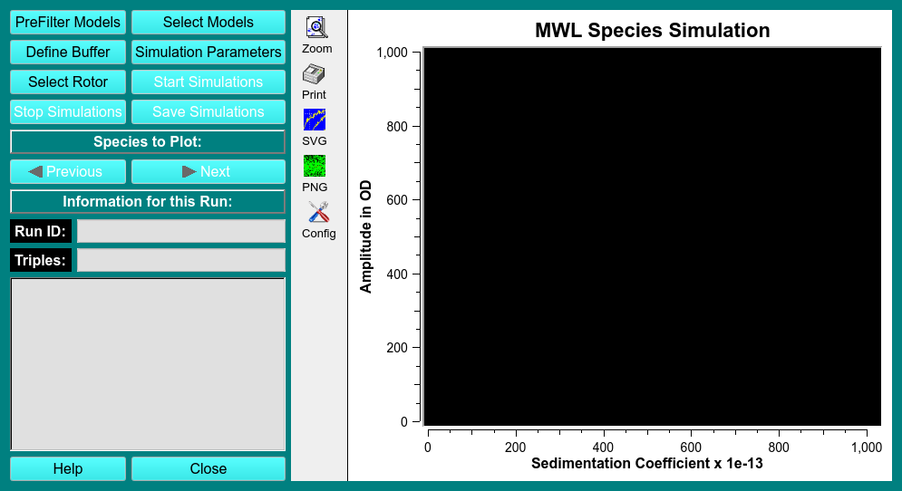

 
MS:  &#x2717; 28.07.22
 
BD: &#x2717;

# Optima Multiwavelength Fit Simulation
   
!!! danger ""

    {width="1000"}
    
<u>PreFilter Models</u>

<u>Select Models</u>

<u>Define 'Buffer'</u>

<u>Simulation Parameters</u>

??? danger "Simulation Parameters Dialogue"

    !!! danger " "

        {width="1000"}
    
        FITTING CONTROLS

<u>Select Rotor</u>

<u>Start Simulations</u>

<u>Stop Simulations</u>

<u>Save Simulations</u>

<u>Species to Plot</u>