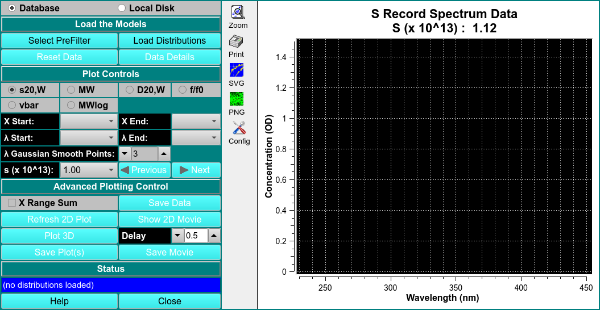

 
MS:  &#x2717; 28.07.22
 
BD: &#x2717;

# View Multiwavelength Spectra

!!! danger ""

    {width="1000"}

Load the Modesl

<u>Select PreFilter</u>

<u>Load Distributions</u>

<u>Reset Data</u>

<u>Data Details</u>

PLOT CONTROLS

<u>s20,W</u>

<u>MW</u>

<u>D20,W</u>

<u>f/f0</u>

<u>vbar</u>

<u>MWlog</u>

<u>X Start/ X End</u>

<u>$\lambda$ Start/ $\lambda$ End</u>

<u>$\lambda$ Gaussian Smooth Points</u>

<u>s ($\times 10^{13}$)</u>

ADVANCED PLOTTING CONTROL

<u>X Range Sum</u>

<u>Save Data</u>

<u>Refresh 2D Movie</u>

<u>Show 2D Movie</u>

<u>Plot 3D</u>

<u>Delay</u>

<u>Save Plot(s)</u>

<u>Save Movie</u>