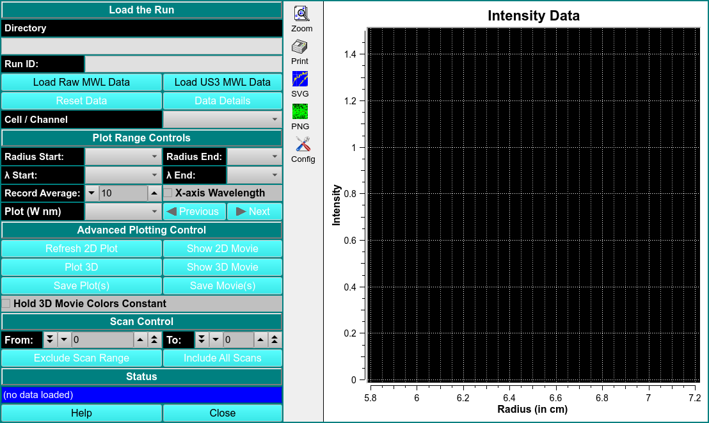

 
MS:  &#x2717; 28.07.22
 
BD: &#x2717;

# View Multiwavelength Data

!!! danger ""

    {width="1000"}
    
<u>Load Raw MWL Data</u>

<u>Load US3 MWL Data</u>
    
PLOT RANGE CONTROLS

<u>Radius Start/Radius End</u>

<u>$\lambda$ Start/$\lambda$ End</u>

<u>Record Average</u>

<u>X-Axis Wavelength</u>

<u>Plot</u>

ADVANCED PLOTTING CONTROL

<u>Plot 2D</u>

<u>Plot 3D</u>

<u>Show 2D Movie</u>

<u>Show 3D Movie</u>

<u>Save Plot(s)</u>

<u>Save Model(s)</u>