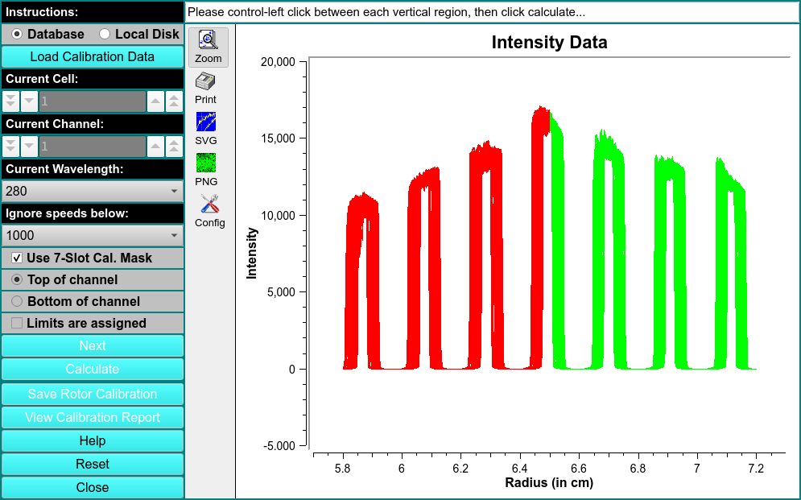
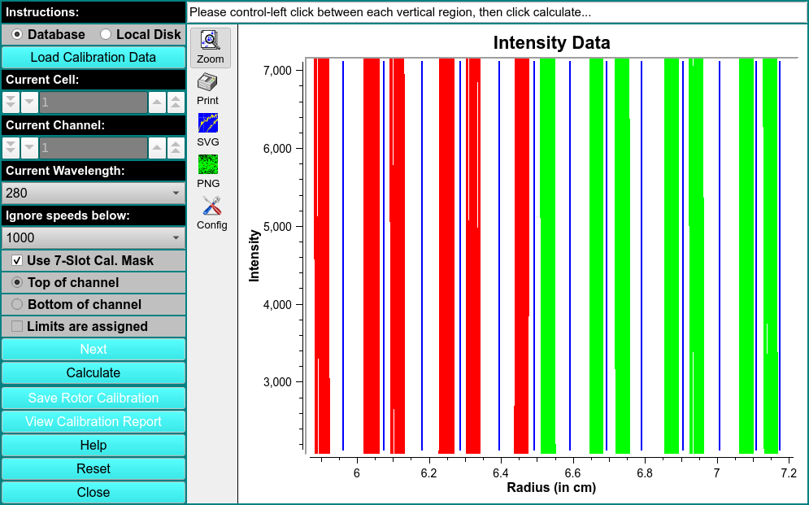
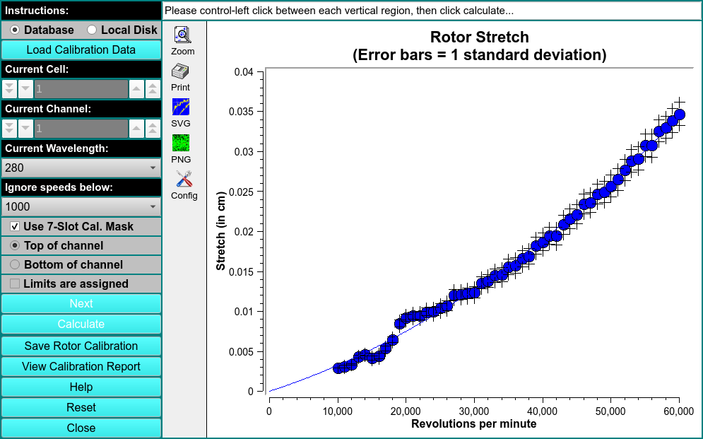

# Rotor Calibration

This module is used to create a rotor calibration report.

Ignore speeds below 10,000 rpm.

Select box for Use 7-slot Cal. Mask.

!!! danger ""

    

!!! danger ""

    

!!! danger ""

    