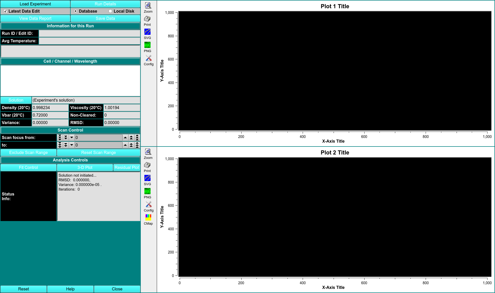

 
MS: $\checkmark$ 28.07.22
 
BD: &#x2717;

# 2-D Spectrum Analysis

This module enables you to perform 2DSA on a chosen experimental data set. Upon completion of an analysis fit, there are several plots available: experiment, simulation, overlayed experiment and simulation, residuals, time-invariant noise, radially-invariant noise, and 3-D model. 

The 2DSA method is used for composition analysis of sedimentation velocity experiments. It can generate sedimentation coefficient, diffusion coefficient, frictional coefficient, $f/f_{0}$ ratio, and molecular weight distributions. The distributions can be plotted as 3-D plots, with the third dimension representing the concentration of the solute found in the composition analysis. The set of all such final calculated solutes for a model which are used to generate a simulation via Lamm equations. This simulation is then plotted overlaying a plot of the experimental data. 

Each 2DSA pass can be repeated for a specified number of refinement iterations These iterations, in turn, can be repeated for a specified number of meniscus points or Monte Carlo iterations. 

Each refinement iteration proceeds over a defined grid of $s$ and $f/f_{0}$ values. That grid is divided into sub-grids as defined by a number of grid refinements in each direction.

!!! danger ""

    {width="1000"}

CONTROLS

<u>3-D Plot</u> Open a control window for a 3-D dimensional plot of the final computed model. 

<u>Residual Plot</u> Open a plot dialog for a far more detailed set of results plots. 

<u>Status Info</u> This text window displays continually updated summaries of computational activity and results.

<u>Fit Control</u> See 2DSA Fit Control Dialogue.

??? danger "2DSA Fit Control Dialogue"

    !!! danger " "

        The parameters of this dialog define and control an analysis run to find the set of solutes that best fits experimental data. 

        {width="1000"}
    
        FITTING CONTROLS
    
        <u>Lower/Upper Limit (s)</u> Set a lower/upper limit of sedimentation coefficient values to scan.
    
        <u>Number Grid Points (s)</u> Set the total grid count of sedimentation coefficient points.
      
        <u>Lower/Upper Limit (f/f0)</u> Set a lower/upper limit of frictional ratio values to scan.
    
        <u>Number Grid Points (f/f0)</u> Set the total grid count of frictional ratio points.

        <u>Thread Count</u> Specify by counter the number of threads to use for computations. This value is the total number of worker threads used at one time. 

        <u>Fit Time-Invariant Noise</u> Check this box if you want to calculate time-invariant noise.

        <u>Fit Radially-Invariant Noise</u> Check this box if you want to calculate radially-invariant noise.

        <u>Automatically Plot</u> Check this box if you want plot dialogues to automatically open at the completion of all calculations.

        <u>Vary Vbar with Constant f/f0</u> Check this box if you want to vary vbar while holding f/f0 constant.
    
        OPTIMIZATION METHODS
        
        <u>Uniform Grid</u> Check this box if Uniform Grid is your preferred optimization method.

        <u>Custom Grid</u> Check this box if you wish to have a custom grid as your preferred optimization method.
    
        <u>Float Meniscus/Bottom</u> Check this box if you wish to wrap the refinement iterations in outer interactions of meniscus/bottom scans. Checking this option means that Monte Carlo may not be chosen.
    
        <u>Load Model</u>

        <u>Fit Range</u>

        <u>Fit Grid Points</u>
      
        <u>Monte Carlo Iterations</u> Select a number of Monte Carlo interactions to perform. A separate model is produced from each iteration.

        <u>Advanced Analysis Controls</u>

        <u>Use Iterative Method</u> Check this box if you want to refine analysis fits with multiple refinement interactions.

        <u>Maximum Iterations</u> Select the number of maximum number of refinement iterations. This number may not be reached if subsequent iterations achieve the same set of computed solutes or if their variances differ by a very small amount.

        <u>Plot Norm Grid</u>

        <u>Norm Tolerance</u>

        STATUS INFORMATION

        <u>Estimated Memory</u> Text showing a memory use estimate based on chosen parameters.
    
        <u>Completed Iteration</u> Display of the last completed refinement iteration completed.

        <u>Old Variance</u> The variance value of the previous iteration.

        <u>New Variance</u> The variance value of the last completed iteration.

        <u>Improvement</u> The difference between the variance value from the last iteration and the one preceeding it.
 