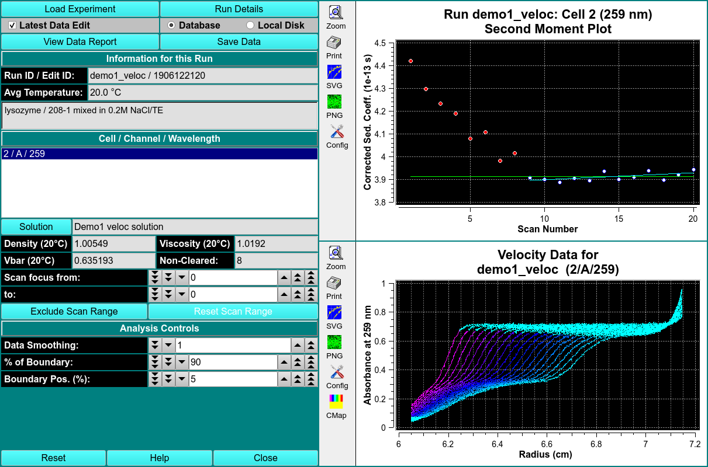

 
MS: &#x2717;
 
BS: &#x2717;

# Second Moment

The second moment analysis will calculate weight-average sedimentation coefficients for each scan included in the analysis by finding the second moment point in the boundary. The second moment analysis can serve as a valuable diagnostics tool in identifying problems such as time-dependent degradation, aggregation and even concentration dependency. It is important to keep in mind that the second moment analysis is only valid for scans that have cleared the meniscus and still have a stable plateau. All other scans should be excluded.

!!! danger "Second Moment Analysis"

    