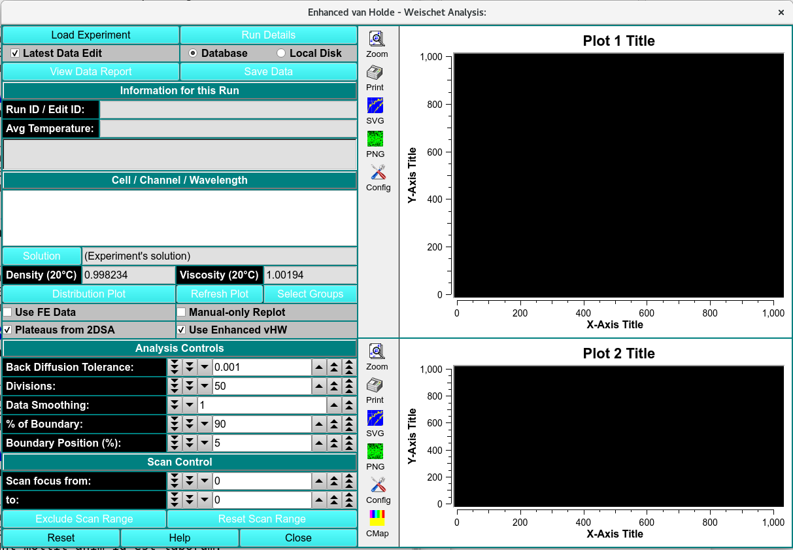
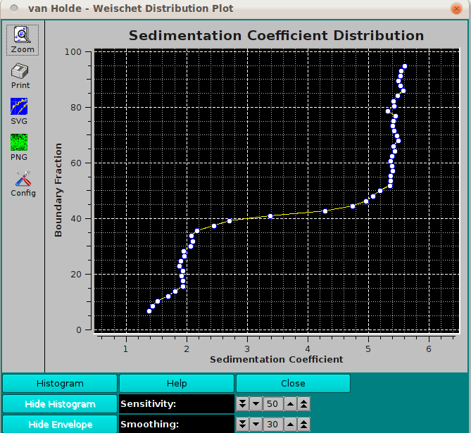
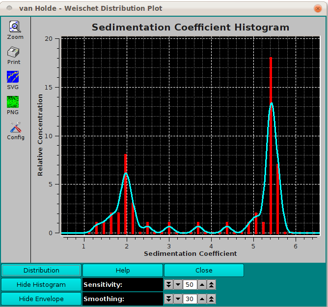

# Enhanced Van Holde-Weischet

The method of Van Holde and Weischet (vHW) is a versitile, model-indepedent approach to determine sedimentation coefficient distributions by graphically analayzing sedimentation velocity experimental data.

!!! warning ""

    
  

$\textbf{Distribution Plot}$ Click here for a plot dialog that will show a vHW distribution plot illustrating sedimentation coefficeint power related to seperate species.

!!! warning "van Holde-Weischet Distribution/Histogram Plots"

    The following plots show the clusting of data around several sedimention coefficient points, indicating the presence of multiple species in the solution.

    {width="800"}  
    
    This is the distribution plot option. It is plotted as the boundary fraction as a function of the sedimentation coefficient. In this particular plot, we see ~15% of our species at ~2S, and ~45% at ~5.2S.
     
    {width="800"} 
    
    This is the histogram plot option. It is plotted as the relative concentration as a function of the sedimentation coefficient. Again, we see the same data as in the distribution plot. 

    $\textbf{Sensitivity}$ Change the sensitivity factor up or down to affect the nature of the histogram.
    
    $\textbf{Smoothing}$ Change the smoothing factor up or down to affect the nature of the envelope.
     
    
$\textbf{Select Groups}$ Click on this utton to begin a session of choosing vHW Extrapolatino Plot division groups. Multiple groups can be chosen, with division line overlap between groups.

$\textbf{Use FE Data}$
 
$\textbf{Plateaus from 2DSA}$ Check this box to have plateau values calculated from a model associated with any loaded noise values. If this box is unchecked, each scan's plateau value is determined by a series of fits to initally designated plateaus.

$\textbf{Manual-only Replot}$ Check this box to supress automatic re-plotting with each parameter change. 

$\textbf{Use Enhanced vHW}$

***
ANALYSIS CONTROLS
***

$\textbf{Back Diffusion Tolerance}$ Select a tolerance value to fine tune exclusion of points affected by back diffusion.

$\textbf{Divisions}$ Choose the number of divisions to use in vHW analysis.

$\textbf{Data Smoothing}$ Choose the number of points to use for any smoothing of raw input data.

$\textbf{% of Boundary}$ Choose the percentage of the range from concentration baseline to plateau that is used for analysis.

$\textbf{Boundary Position (%)}$ Choose the percent of the plateau-baseline range that is to be added to the baseline to form the beginning of the analysis span.

