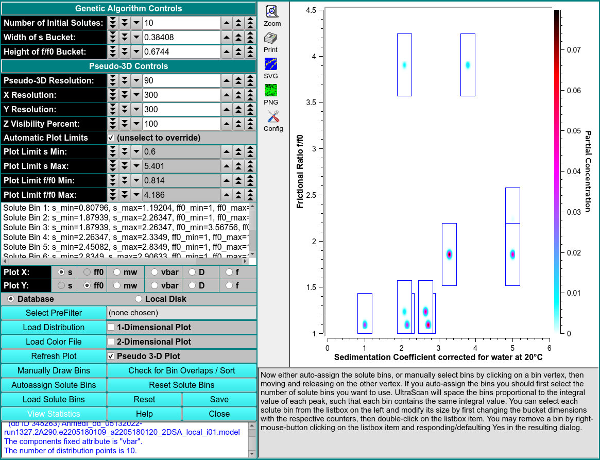

 
MS: &#x2717;
 
BS: &#x2717;

# Initialize Genetic Algorithm

Solute distribution data can be used to generate data for use with Genetic Algorithm analysis programs. The output data results from choosing bins (or buckets) around solute points. These buckets can be modified for better results. Once they are as desired, data for Genetic Algorithm analysis can be generated and output. 

The input data may come in one of two flavors, each of which is treated differently. The data is either SA2D type or Monte Carlo. The 2DSA is relatively sparse and generally requires fashioning buckets containing a single point. 

!!! danger "Genetic Algorithm Initialization Control Window"

    
    
***
GENETIC ALGORITHM CONTROLS
***

<u>Number of Initial Solutes</u>

<u>Weight of s Bucket</u>

<u>Height of f/f0 Bucket</u>

***
PSEUDO 3-D CONTROLS
***

<u>Pseudo 3-D Resolution</u>

<u>X/Y Resolution</u>

<u>Z Visibility Percent</u>

<u>Plot Limits (Max,Min)</u>

<u>Plot X</u>

<u>Plot Y</u>

***
PLOT CONTROLS
***

<u>Select Pre-Filter</u>

<u>Load Distribution</u>

<u>Load Color File</u>

<u>Manually Draw Bins</u>

<u>Auto-assign Solute Bins</u>

<u>Load Solute Bins</u>

<u>Check for Bin Overlaps/Sort</u>
