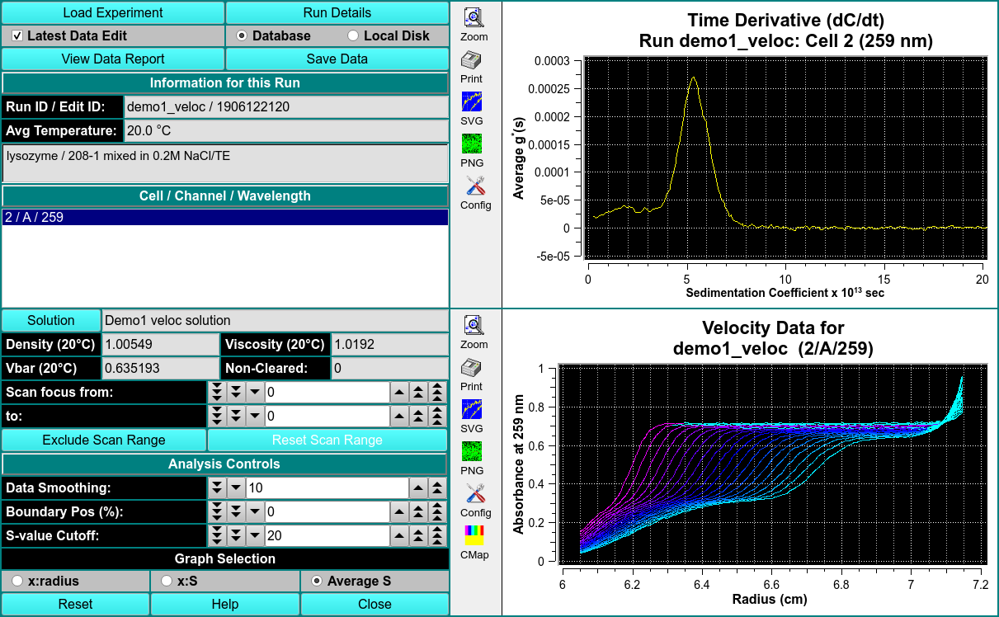

# Time Derivative

This module will calculte g(S) differential sedimentation profiles by subtracting consectutive scan pairs from each other and mapping the resulting difference curves to the S domain to obtain dc/dt curves. 

The advantage of this method is its ability to nicely subtract out time invariant noise. Unlike the [van Holde-Weischet module](/probable-eureka/velocity-evhw), the Time Derivative method does not correct for diffusion. In order to obtain accurate results, it is important to use only a small scan range over which diffusion has not change significantly.

!!! warning ""

    
 
ANALYSIS CONTROLS

<u>Data Smoothing</u> Choose the number of points to use for any smoothing of raw input data. 

<u>Boundary Pos. (%)</u> Choose the percent of the plateau-baseline range that is to be added to the baseline to form the beginning of analysis span. 

<u>S-value Cutoff</u> Choose the sedimentation coefficient value to form the maximum X value of the Time Derivative plot. 

GRAPH SELECTION

<u>x:radius</u> Select this radio button to choose a g*(S) versus radius dC/dt plot. 

<u>x:S</u> Select this radio button to choose a g*(S) versus sedimentation coefficient dC/dt plot. 

<u>Average S</u> Select this radio button to choose an Average g*(S) versus sedimentation coefficient dC/dt plot. 